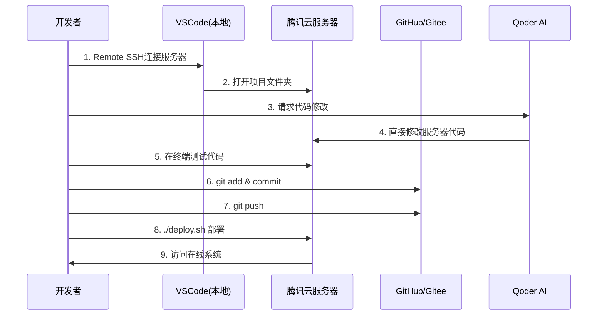

# AI-Seckill-Hybrid 腾讯云部署与开发完整指南

## 📋 目录
1. [腾讯云服务器准备](#一腾讯云服务器准备)
2. [Git仓库配置](#二git仓库配置)
3. [服务器环境搭建](#三服务器环境搭建)
4. [源码上传到服务器](#四源码上传到服务器)
5. [VSCode远程开发配置](#五vscode远程开发配置)
6. [Qoder辅助编程集成](#六qoder辅助编程集成)
7. [自动化部署脚本](#七自动化部署脚本)
8. [常见问题排查](#八常见问题排查)

---

## 一、腾讯云服务器准备

### 1.1 购买服务器
- **推荐配置**：4核8G，50GB SSD，5Mbps带宽
- **操作系统**：Ubuntu 22.04 LTS 或 CentOS 7.9
- **地域**：选择离你最近的地区（如广州/上海）

### 1.2 安全组配置
在腾讯云控制台开放以下端口：
```
端口        协议    用途
22          TCP     SSH远程连接
80          TCP     HTTP访问
443         TCP     HTTPS访问
3000        TCP     Vue前端
8080        TCP     API网关
8848        TCP     Nacos控制台
8000        TCP     Python AI服务
3306        TCP     MySQL（建议仅内网访问）
6379        TCP     Redis（建议仅内网访问）
```

### 1.3 登录服务器
```bash
ssh root@你的服务器IP
# 输入密码或使用密钥登录
```

---

## 二、Git仓库配置

### 2.1 本地初始化Git仓库

在你的Windows电脑上执行：

```powershell
cd c:\Users\dell\Desktop\ai-seckill-hybrid

# 初始化Git
git init

# 创建.gitignore文件（如果不存在）
# 确保包含以下内容：
```

创建 `.gitignore` 文件：
```
# Java
target/
*.class
*.jar
*.war
!.mvn/wrapper/maven-wrapper.jar

# Python
__pycache__/
*.pyc
*.pyo
venv/
.env

# Node
node_modules/
dist/
.DS_Store

# IDE
.vscode/
.idea/
*.iml

# Docker
docker-compose.override.yml

# Logs
*.log
logs/

# OS
Thumbs.db
```

```powershell
# 添加所有文件
git add .

# 首次提交
git commit -m "Initial commit: AI-Seckill-Hybrid project"

# 关联远程仓库（选择以下任一方式）
```

### 2.2 选择Git托管平台

**方案A：GitHub（推荐）**
```powershell
# 1. 在GitHub创建新仓库 ai-seckill-hybrid
# 2. 关联远程仓库
git remote add origin https://github.com/你的用户名/ai-seckill-hybrid.git

# 3. 推送代码
git branch -M main
git push -u origin main
```

**方案B：Gitee（国内速度快）**
```powershell
# 1. 在Gitee创建新仓库
# 2. 关联远程仓库
git remote add origin https://gitee.com/你的用户名/ai-seckill-hybrid.git

# 3. 推送代码
git branch -M main
git push -u origin main
```

**方案C：腾讯云CODING**
```powershell
# 使用腾讯云CODING平台
git remote add origin https://e.coding.net/你的团队/ai-seckill-hybrid.git
git push -u origin main
```

---

## 三、服务器环境搭建

### 3.1 安装Docker和Docker Compose

连接到服务器后执行：

```bash
# Ubuntu系统
sudo apt update
sudo apt install -y docker.io docker-compose

# CentOS系统
sudo yum install -y docker docker-compose

# 启动Docker
sudo systemctl start docker
sudo systemctl enable docker

# 验证安装
docker --version
docker-compose --version

# 将当前用户加入docker组（避免每次都用sudo）
sudo usermod -aG docker $USER
newgrp docker
```

### 3.2 安装Git

```bash
# Ubuntu
sudo apt install -y git

# CentOS
sudo yum install -y git

# 验证
git --version
```

### 3.3 配置服务器Git

```bash
# 配置Git用户信息
git config --global user.name "你的名字"
git config --global user.email "你的邮箱"

# 生成SSH密钥（用于免密拉取代码）
ssh-keygen -t rsa -b 4096 -C "你的邮箱"

# 查看公钥
cat ~/.ssh/id_rsa.pub

# 将公钥添加到GitHub/Gitee的SSH Keys中
```

### 3.4 创建项目目录

```bash
# 创建项目目录
mkdir -p /opt/ai-seckill
cd /opt/ai-seckill

# 克隆代码仓库
git clone https://github.com/你的用户名/ai-seckill-hybrid.git .

# 或者使用SSH方式（推荐）
git clone git@github.com:你的用户名/ai-seckill-hybrid.git .
```

---

## 四、源码上传到服务器

### 方案A：通过Git推送（推荐）

**优点**：版本控制清晰，便于回滚

```bash
# 在服务器上
cd /opt/ai-seckill
git pull origin main
```

### 方案B：使用SCP直接传输

```powershell
# 在Windows PowerShell中执行
cd c:\Users\dell\Desktop\ai-seckill-hybrid

# 压缩项目（排除不必要的文件）
tar -czf ai-seckill-hybrid.tar.gz `
  --exclude=node_modules `
  --exclude=target `
  --exclude=__pycache__ `
  --exclude=.git `
  --exclude=venv `
  .

# 上传到服务器
scp ai-seckill-hybrid.tar.gz root@你的服务器IP:/opt/

# 在服务器上解压
ssh root@你的服务器IP
cd /opt
tar -xzf ai-seckill-hybrid.tar.gz -C /opt/ai-seckill
```

### 方案C：使用rsync同步（实时同步）

```powershell
# Windows需要安装rsync（可通过Git Bash使用）
# 在Git Bash中执行
rsync -avz --exclude='node_modules' --exclude='target' \
  /c/Users/dell/Desktop/ai-seckill-hybrid/ \
  root@你的服务器IP:/opt/ai-seckill/
```

---

## 五、VSCode远程开发配置

### 5.1 安装VSCode扩展

在本地VSCode中安装：
1. **Remote - SSH**（微软官方）
2. **Remote Explorer**
3. **Remote - Containers**（可选）

### 5.2 配置SSH连接

1. 按 `F1` 或 `Ctrl+Shift+P`
2. 输入 `Remote-SSH: Connect to Host...`
3. 选择 `Add New SSH Host...`
4. 输入：`ssh root@你的服务器IP`
5. 选择SSH配置文件路径（默认即可）
6. 输入服务器密码

### 5.3 编辑SSH配置文件

打开 `~/.ssh/config` 文件（Windows: `C:\Users\你的用户名\.ssh\config`），添加：

```
Host ai-seckill-server
    HostName 你的服务器IP
    User root
    Port 22
    IdentityFile C:\Users\你的用户名\.ssh\id_rsa  # 如果使用密钥登录
    ForwardAgent yes
```

### 5.4 连接远程服务器

1. 点击VSCode左下角的绿色图标
2. 选择 `Connect to Host...`
3. 选择 `ai-seckill-server`
4. 输入密码
5. VSCode会在新窗口打开远程服务器

### 5.5 在远程服务器上开发

连接成功后：
- 点击 `文件 > 打开文件夹`
- 选择 `/opt/ai-seckill`
- 现在你可以像在本地一样编辑服务器上的代码
- 所有修改直接保存在服务器上

### 5.6 配置VSCode同步设置

在远程VSCode中安装相同的扩展：
- Vue Language Features (Volar)
- Spring Boot Extension Pack
- Python
- Docker
- GitLens

---

## 六、Qoder辅助编程集成

### 6.1 Qoder工作原理

Qoder通过以下方式辅助云端开发：

**方式1：本地Qoder + 远程文件**
```
1. 在本地VSCode中使用Qoder
2. Qoder可以访问通过Remote SSH打开的远程文件
3. 所有代码修改直接应用到服务器
```

**方式2：完全云端开发**
```
1. 在服务器上安装code-server（VSCode网页版）
2. 通过浏览器访问 http://你的服务器IP:8080
3. 理论上可以在code-server中集成AI助手
```

### 6.2 推荐工作流

```mermaid
graph LR
    A[本地VSCode] -->|Remote SSH| B[腾讯云服务器]
    B -->|编辑代码| C[/opt/ai-seckill]
    C -->|Git Push| D[GitHub/Gitee]
    A -->|Qoder辅助| E[智能代码生成]
    E -->|自动应用| C
    C -->|Docker部署| F[运行服务]
```

**具体步骤：**

1. **本地启动Qoder**
   - 在Windows上正常打开VSCode
   - 通过Remote SSH连接到服务器
   - Qoder会自动识别远程文件系统

2. **使用Qoder修改代码**
   ```
   告诉Qoder："修改秒杀服务的库存扣减逻辑"
   Qoder会：
   - 分析远程服务器上的代码
   - 生成修改方案
   - 直接应用到服务器文件
   ```

3. **测试和部署**
   ```bash
   # 在VSCode终端中（已连接到服务器）
   cd /opt/ai-seckill/seckill-parent
   mvn clean package -DskipTests
   
   # 重启服务
   docker-compose restart seckill-inventory-service
   ```

### 6.3 Qoder最佳实践

```markdown
✅ 推荐做法：
1. 使用Remote SSH连接服务器
2. 在远程环境中使用Qoder
3. Qoder可以直接操作服务器文件
4. 修改后立即在服务器测试

❌ 避免做法：
1. 不要在本地和服务器之间频繁复制文件
2. 不要手动同步代码（用Git）
3. 不要在本地运行大型微服务（资源不足）
```

---

## 七、自动化部署脚本

### 7.1 创建部署脚本

在服务器上创建 `/opt/ai-seckill/deploy.sh`：

```bash
#!/bin/bash
set -e

echo "========================================="
echo "  AI-Seckill-Hybrid 自动化部署脚本"
echo "========================================="

PROJECT_DIR="/opt/ai-seckill"
cd $PROJECT_DIR

# 1. 拉取最新代码
echo "[1/5] 拉取最新代码..."
git pull origin main

# 2. 停止旧服务
echo "[2/5] 停止旧服务..."
docker-compose down

# 3. 构建镜像
echo "[3/5] 构建Docker镜像..."
docker-compose build

# 4. 启动服务
echo "[4/5] 启动服务..."
docker-compose up -d

# 5. 检查服务状态
echo "[5/5] 检查服务状态..."
sleep 10
docker-compose ps

echo ""
echo "========================================="
echo "  部署完成！"
echo "========================================="
echo "访问地址："
echo "  前端: http://你的服务器IP:3000"
echo "  API:  http://你的服务器IP:8080"
echo "  Nacos: http://你的服务器IP:8848/nacos"
echo "========================================="
```

赋予执行权限：
```bash
chmod +x /opt/ai-seckill/deploy.sh
```

### 7.2 一键部署命令

```bash
# 在服务器上执行
cd /opt/ai-seckill
./deploy.sh
```

### 7.3 配置Git Hook自动部署（可选）

在服务器上创建 `/opt/ai-seckill/.git/hooks/post-receive`：

```bash
#!/bin/bash
echo "检测到代码更新，自动部署..."
cd /opt/ai-seckill
./deploy.sh
```

---

## 八、完整工作流程示例

### 日常开发流程



### 具体操作步骤

#### **第1天：初始设置**

```powershell
# === 在本地Windows电脑上 ===

# 1. 初始化Git仓库
cd c:\Users\dell\Desktop\ai-seckill-hybrid
git init
git add .
git commit -m "Initial commit"

# 2. 创建GitHub仓库并推送
git remote add origin https://github.com/你的用户名/ai-seckill-hybrid.git
git push -u origin main

# 3. 配置VSCode Remote SSH
# - 安装Remote SSH扩展
# - 连接到服务器
```

```bash
# === 在腾讯云服务器上 ===

# 1. 安装Docker
sudo apt update && sudo apt install -y docker.io docker-compose

# 2. 克隆代码
mkdir -p /opt/ai-seckill
cd /opt/ai-seckill
git clone https://github.com/你的用户名/ai-seckill-hybrid.git .

# 3. 启动基础设施
docker run -d --name mysql -p 3306:3306 \
  -e MYSQL_ROOT_PASSWORD=root123456 \
  -e MYSQL_DATABASE=seckill \
  mysql:8.0

docker run -d --name redis -p 6379:6379 redis:7-alpine

docker run -d --name nacos -p 8848:8848 \
  -e MODE=standalone \
  nacos/nacos-server:v2.3.0

# 4. 初始化数据库
docker exec -i mysql mysql -uroot -proot123456 seckill < schema.sql

# 5. 编译Java项目
cd seckill-parent
mvn clean install -DskipTests

# 6. 启动微服务（每个服务一个终端）
# 终端1
cd seckill-gateway && mvn spring-boot:run

# 终端2
cd seckill-user-service && mvn spring-boot:run

# ... 其他服务类似

# 7. 启动Python AI
cd python-ai-agent
python -m venv venv
source venv/bin/activate
pip install -r requirements.txt
uvicorn app.main:app --host 0.0.0.0 --port 8000

# 8. 启动前端
cd seckill-frontend
npm install
npm run dev
```

#### **日常开发（第2天及以后）**

```powershell
# === 在本地Windows ===

# 1. 打开VSCode
# 2. Ctrl+Shift+P -> Remote-SSH: Connect to Host
# 3. 选择 ai-seckill-server
# 4. VSCode在新窗口打开，连接到服务器

# 5. 在远程VSCode中使用Qoder
#    - 打开任意Java文件
#    - 告诉Qoder："帮我优化这个方法的性能"
#    - Qoder直接修改服务器上的文件

# 6. 在VSCode终端中测试
cd /opt/ai-seckill/seckill-parent/seckill-inventory-service
mvn test

# 7. 提交代码
git add .
git commit -m "优化库存扣减逻辑"
git push

# 8. 部署
cd /opt/ai-seckill
./deploy.sh
```

---

## 九、监控和维护

### 9.1 查看服务日志

```bash
# 查看所有容器日志
docker-compose logs -f

# 查看特定服务日志
docker-compose logs -f gateway
docker-compose logs -f seckill-inventory-service

# 查看Java服务日志
tail -f /opt/ai-seckill/seckill-parent/seckill-gateway/logs/app.log
```

### 9.2 监控系统资源

```bash
# 实时监控
htop

# 查看Docker资源使用
docker stats

# 查看磁盘空间
df -h
```

### 9.3 备份数据

```bash
# 备份MySQL
docker exec mysql mysqldump -uroot -proot123456 seckill > /backup/seckill_$(date +%Y%m%d).sql

# 备份Redis
docker exec redis redis-cli BGSAVE

# 定时备份（crontab）
crontab -e
# 每天凌晨2点备份
0 2 * * * /opt/ai-seckill/backup.sh
```

---

## 十、常见问题排查

### 问题1：端口被占用

```bash
# 查看端口占用
netstat -tlnp | grep 8080

# 杀死占用进程
kill -9 PID
```

### 问题2：内存不足

```bash
# 查看内存使用
free -h

# 增加Swap空间
sudo fallocate -l 4G /swapfile
sudo chmod 600 /swapfile
sudo mkswap /swapfile
sudo swapon /swapfile
```

### 问题3：Docker容器启动失败

```bash
# 查看容器状态
docker ps -a

# 查看容器日志
docker logs 容器ID

# 重启容器
docker-compose restart 服务名
```

### 问题4：Git推送失败

```bash
# 配置Git代理（如果需要）
git config --global http.proxy http://127.0.0.1:7890
git config --global https.proxy http://127.0.0.1:7890

# 使用SSH代替HTTPS
git remote set-url origin git@github.com:用户名/仓库名.git
```

---

## 十一、性能优化建议

### 11.1 JVM参数调优

编辑 `seckill-parent/seckill-gateway/src/main/resources/application.yml`：

```yaml
jvm:
  options: "-Xms512m -Xmx1024m -XX:+UseG1GC"
```

### 11.2 Docker资源限制

编辑 `docker-compose.yml`：

```yaml
services:
  gateway:
    deploy:
      resources:
        limits:
          cpus: '1.0'
          memory: 1G
```

### 11.3 Nginx反向代理（生产环境）

```nginx
server {
    listen 80;
    server_name your-domain.com;
    
    location / {
        proxy_pass http://localhost:3000;
    }
    
    location /api/ {
        proxy_pass http://localhost:8080;
    }
}
```

---

## 十二、总结

### 推荐工具链

| 工具 | 用途 | 链接 |
|------|------|------|
| VSCode + Remote SSH | 远程开发 | 微软官方扩展 |
| Qoder | AI辅助编程 | 当前使用 |
| Docker | 容器化部署 | docker.com |
| Git | 版本控制 | github.com |
| tmux | 终端复用 | Linux内置 |

### 最佳实践

✅ **一定要做：**
1. 使用Git管理所有代码
2. 使用Docker Compose编排服务
3. 定期备份数据库
4. 使用VSCode Remote SSH开发
5. 编写自动化部署脚本

❌ **不要做：**
1. 直接在服务器上手动修改代码（不用Git）
2. 不使用容器（直接安装软件）
3. 不备份数据
4. 在生产环境开启调试模式
5. 暴露敏感端口到公网

---

## 快速开始清单

```bash
# 1. 购买腾讯云服务器（4核8G）
# 2. 配置安全组（开放22/80/443/3000/8080/8848端口）
# 3. SSH登录服务器
ssh root@你的服务器IP

# 4. 安装Docker
sudo apt update && sudo apt install -y docker.io docker-compose

# 5. 克隆代码
git clone https://github.com/你的用户名/ai-seckill-hybrid.git /opt/ai-seckill

# 6. 启动基础设施
cd /opt/ai-seckill
docker-compose up -d mysql redis nacos

# 7. 初始化数据库
docker exec -i seckill-mysql mysql -uroot -proot123456 seckill < schema.sql

# 8. 配置VSCode Remote SSH
# 9. 连接服务器开始开发
# 10. 使用Qoder辅助编程
```

---

**祝你部署顺利！🚀**

如有问题，随时询问Qoder！
